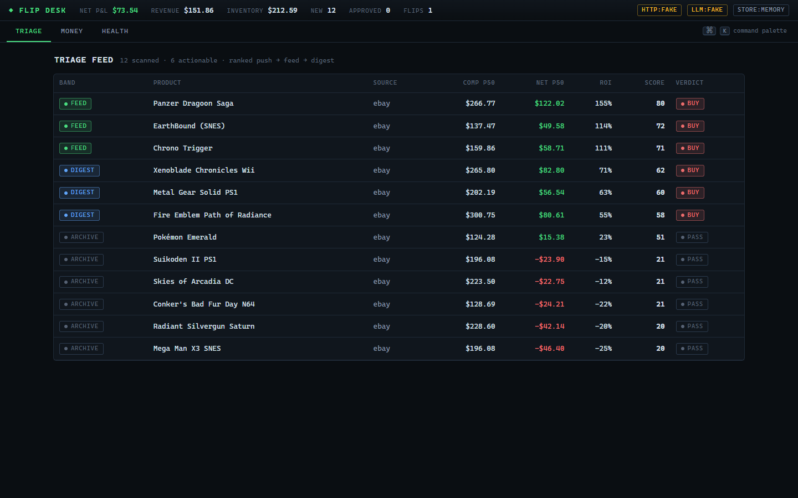
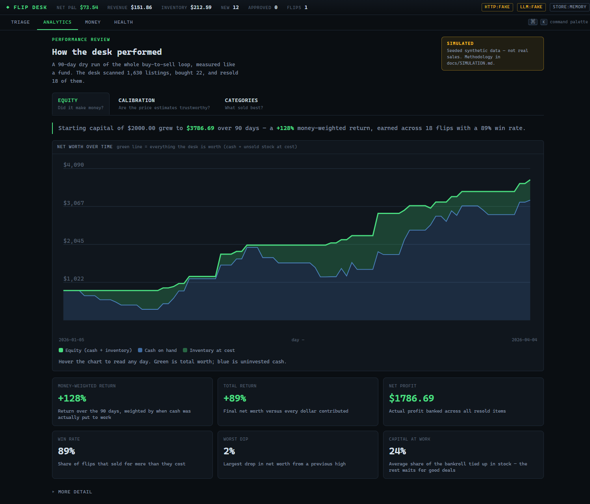
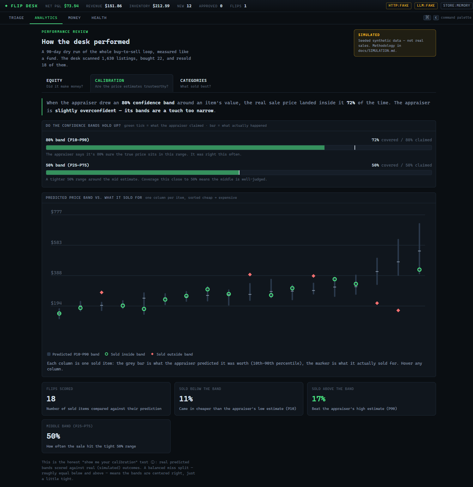
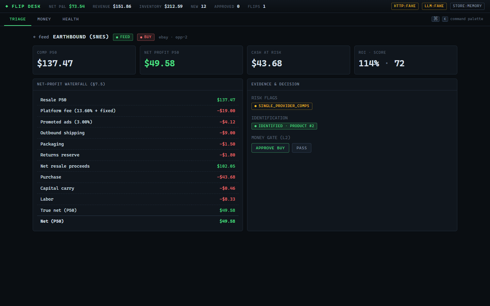
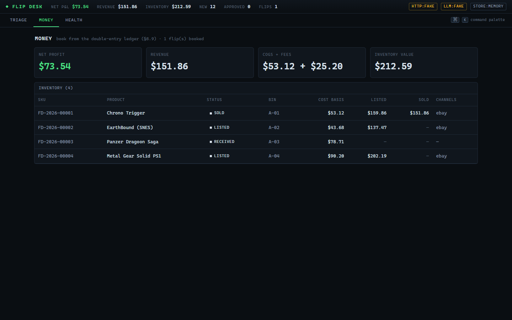

# Resale Price Gap Engine
n> Internally named `flip-desk` — packages are scoped `@flipdesk/*`.

**Compliance-first resale-arbitrage engine.** A 42-package TypeScript monorepo that runs the full
**discover → identify → value → underwrite → rank → alert → buy → list → reprice → sell → ship →
account → learn** loop behind an exact integer-cents double-entry ledger. Every external dependency
(HTTP, LLM, mail, carriers, marketplaces, database) sits behind a seam with a deterministic fake, so
the whole system runs — and is tested — **fully offline**, with no keys, no network, and no database.
Flipping to live eBay + LLM extraction is a one-line config change, not a code change.

- **305 tests, green** · `tsc -b` clean · Next.js 15 terminal UI that demos entirely offline.
- Runs the *real* engine over a deterministic demo corpus out of the box — the same code path the
  live system uses, just fed a fixture.
- **Measured like a fund.** A deterministic 90-day market simulation drives the real engine and ledger
  and produces an equity curve, money-weighted return, appraisal-band calibration, and per-category
  ROI — rendered both as an in-app **Analytics** dashboard and a shareable HTML tearsheet.
- **Persists to SQLite.** The `Store` seam ships two implementations — in-memory and a
  `better-sqlite3`-backed store that survives restarts — behind one parameterized contract suite.

---

## Why it's interesting

- **Money math is exact.** Currency is `bigint` cents end to end; a double-entry ledger is
  property-tested for balance invariants (`@flip-desk/money`). Floats never touch money.
- **Everything is a seam.** Ingestion, sold-comps, exit channels, HTTP, the LLM, and persistence are
  all narrow interfaces with fakes. The composition root (`@flip-desk/runtime`) picks fake or live per
  seam from the environment — nothing downstream knows the difference.
- **Compliance is enforced in code, not in a doc.** Every consequential action passes a **Sentinel**
  that resolves kill-switches, tier enablement, signed opt-ins, spend caps, and autonomy level before
  anything happens. Sources are scored `T0–T5`; actions run at autonomy `L0–L4`. See
  [`COMPLIANCE.md`](COMPLIANCE.md).
- **Stop, don't sneak.** On any block/ban/lockout a module *halts and alerts* — it never rotates
  identities, spoofs fingerprints, or evades. This is chaos-tested, not hoped for.
- **A learning loop.** Calibration and model weights refit from realized outcomes; a class *earns*
  more autonomy on a clean track record and is demoted instantly on a breach.

---

## Architecture at a glance

```
SourceAdapter → pipeline → identify → providers → appraise → underwrite → rank ─┐
                                                                                 │
                                                             ┌── Sentinel ◄──────┘
                                            gate L0–L2 ──────┤
                                            allow L3–L4 ─────┴─→ acquire → intake →
                                            lister/crosslist → pricer → exit (delist saga)
                                            → bookkeeper (ledger) → regret + learn ─┐
                                                                                    │
                                            calibration feedback ◄──────────────────┘
```

Full package map, seam table, data flow, and the tier/autonomy model are in
[`docs/ARCHITECTURE.md`](docs/ARCHITECTURE.md).

---

## Quickstart (zero keys, fully offline)

Requires **Node 22** (see `.nvmrc`).

```bash
npm install
npm test              # vitest — 305 tests, no network, no keys
npm run typecheck     # tsc -b across all 42 packages
npm run demo          # the terminal UI at http://localhost:3000 (seeds + boots)
```

Two more commands worth running:

```bash
npm run sim -- --days 90 --seed 42 --out reports/sim-90d.html   # deterministic tearsheet
npm run bench                                                    # engine + store throughput
```

`npm run web:dev` boots the Next.js terminal against the demo corpus in an in-memory store — no DB, no
keys, no live sources. To produce a production build instead:

```bash
npm run web:build && npm run web:start
```

### The demo, explained

Out of the box the desk runs the real `@flip-desk/engine` over a deterministic, seeded corpus of
game/console listings (`@flip-desk/api`'s demo seeding) into an `InMemoryStore`. The UI is a dark,
monospace terminal with four screens:

- **Triage** — the ranked opportunity feed (push/feed/digest/archive bands).
- **Analytics** — the fund-style performance review (equity curve, calibration, category ROI),
  computed from a real 90-day simulation at boot. Clearly labeled synthetic.
- **Deal** — evidence, the net-profit waterfall, and the L2 one-tap money gate.
- **Money** — P&L and inventory.
- **Health** — adapter/tier status, with any default-off T4 source shown halted.

The badges in the top-right (`HTTP:FAKE` · `LLM:FAKE` · `STORE:MEMORY`) show the desk running fully
offline — no network, no keys, no database.

**Triage** — the ranked feed:



**Analytics** — the desk measured like a fund (equity, calibration, category ROI), plain-language
labels on every metric, simulated data labeled in the UI:





**Deal** — the net-profit waterfall and the L2 money gate:



**Money** — P&L booked from the double-entry ledger, plus inventory:



---

## Simulation lab — measured like a fund

`@flip-desk/sim` is a **deterministic marketplace simulator**. It generates a seeded synthetic listing
stream over N days from documented category models, then drives the **real** engine
(ingest → identify → appraise → underwrite → rank) day by day and books every buy and sale into the
**real** double-entry ledger. Same seed → identical result, bit-for-bit.

```bash
npm run sim -- --days 90 --seed 42 --out reports/sim-90d.html
```

It writes a self-contained HTML tearsheet (and a markdown twin) with money-weighted return, total
return, IRR, hit rate, hold-day stats, max drawdown, per-category ROI, capital utilization, fee burden,
and **band calibration** — the share of realized sale prices that land inside the appraiser's predicted
P10–P90 and P25–P75. The same computation feeds the in-app **Analytics** dashboard.

> **Everything the lab produces is synthetic and labeled as such** — in the UI, in the HTML header, and
> in [`docs/SIMULATION.md`](docs/SIMULATION.md), which documents the generator, the full parameter
> table, and exactly what this does and does not validate. It validates the machinery and the math, not
> a live trading edge. Invariants it proves (as tests): the ledger is balanced at **every** simulated
> day, and the accounting closes (final equity ≡ contributions + realized net profit).

Valuation methodology — comp selection, band construction, the net-profit waterfall, and the go/no-go
floors, with formulas — is written up in [`docs/VALUATION.md`](docs/VALUATION.md).

---

## Performance

`npm run bench` runs the real ingest → rank pipeline over 10,000 synthetic listings and measures each
`Store`'s write throughput. Measured on this machine (**AMD Ryzen 7 5800X, 34 GB, Node 24**):

| Pipeline | Listings/sec | µs/listing |
|---|---:|---:|
| Engine: ingest → identify → appraise → underwrite → rank (no store) | ~7,500 | ~134 |
| + `InMemoryStore` persist | ~7,200 | ~138 |
| + `SqliteStore` persist (WAL, one insert per opportunity) | ~2,900 | ~340 |

The engine sustains ~7.5k full valuations/sec single-threaded; the in-memory store is effectively free;
the SQLite store pays a per-insert durability cost (WAL fsync) and still clears ~2.9k/sec. Numbers vary
by machine — re-run `npm run bench` to measure yours.

---

## Live vs offline (the seam swap)

Everything is assembled in `@flip-desk/runtime`'s `buildRuntime(config)` from the environment. With
nothing set, the desk is fully offline (fakes + in-memory store). Set the switches below and
individual seams swap to their live implementations — no other code changes:

| Env var | Effect |
|---|---|
| *(none set)* | Fully offline: `FakeLlm`, `FakeTransport`, `InMemoryStore`. This is the demo. |
| `FLIP_DB_PATH=./data/flip.db` | Persistence seam swaps `InMemoryStore` → `SqliteStore` (survives restarts). |
| `ANTHROPIC_API_KEY` | LLM seam swaps to the live `AnthropicLlm` (`/v1/messages`) for extraction + the weekly memo. |
| `FLIP_LIVE_HTTP=1` | HTTP seam swaps `FakeTransport` → `FetchTransport` (real network). |
| `PRICECHARTING_API_KEY`, `KEEPA_API_KEY` | Enable licensed sold-comp providers per vertical. |
| `EBAY_CLIENT_ID`, `EBAY_CLIENT_SECRET` | Enable the eBay Browse / Sell adapters. |
| `LLM_USD_DAY_CAP`, `PURCHASE_USD_DAY_CAP` | Budget/policy ceilings. |

See [`.env.example`](.env.example) for the full list. Copy it to `.env` (gitignored) to fill in.

> **Persistence: shipped (SQLite).** The `Store` seam ships **two** wired implementations —
> `InMemoryStore` (the default, used by the offline demo) and `SqliteStore` (`better-sqlite3`, behind
> the same async interface). Set `FLIP_DB_PATH` and the desk persists across restarts; both stores pass
> the **same** parameterized contract suite, plus restart-survival and migration-idempotency tests. A
> tiny migration runner applies `db/sqlite/*.sql` in order and records each in a `_migrations` table.
> Money stays exact — cents are `bigint`, stored as decimal text and parsed back with `BigInt()`, never
> a float. **Postgres is the same SQL family:** `db/migrations/0001_init.sql` is the production Postgres
> target of which the SQLite tables are the durable projection (dialect mapping in `db/sqlite/0001_init.sql`);
> a Postgres-backed `Store` remains on the roadmap.

---

## Testing

```bash
npm test          # vitest run — 305 tests across 46 files
npm run typecheck # tsc -b — strict, NodeNext, exactOptionalPropertyTypes, noUncheckedIndexedAccess
```

The suite runs with no network and no keys. `fast-check` property tests guard the money ledger; the
`Store` contract suite runs against **both** the in-memory and SQLite stores; the simulation lab is
tested for determinism (identical HTML for identical seed), a balanced ledger at every day, and its
calibration/IRR math; adapters self-test against checked-in fixtures; `@flip-desk/flows` runs
multi-package end-to-end flows (delist saga, paper-trading loop). CI (`.github/workflows/ci.yml`) runs
typecheck + tests + a web typecheck + a Next.js production build, and a determinism check on the sim.

---

## Project structure

```
flip-desk/
├── packages/            # 35 domain packages (core, money, engine, appraise, underwrite, sim, …)
│   └── adapters/        # ebay, ebay-sell, mercari, email, shopgoodwill, noop
├── apps/web/            # Next.js 15 terminal UI (@flip-desk/web) — Triage, Analytics, Money, Health
├── scripts/             # sim.ts (tearsheet CLI), bench.ts (throughput)
├── db/
│   ├── migrations/      # target Postgres schema (design artifact)
│   └── sqlite/          # SQLite projection schema — the SqliteStore's migrations
├── docs/                # ARCHITECTURE.md, SIMULATION.md, VALUATION.md, screenshots/
├── docker-compose.yml   # optional local infra (Postgres/pgvector, Redis, MinIO) — roadmap
├── COMPLIANCE.md        # normative tier/autonomy invariants (enforced by the Sentinel)
└── .env.example         # every switch; copy to .env to go live
```

## Toolchain

Node 22 · npm workspaces (no pnpm) · TypeScript (strict, NodeNext, `exactOptionalPropertyTypes`,
`noUncheckedIndexedAccess`) · vitest + fast-check · Next.js 15 / React 19. Internal packages export
`./src/index.ts` directly, so tooling resolves TypeScript source with no build step. The optional
`docker-compose.yml` (Postgres+pgvector, Redis, MinIO) sits behind seams and is not needed for tests
or the demo.

## Roadmap & honest limitations

- **Persistence:** in-memory and SQLite stores are both wired and pass the same contract suite. The
  Postgres schema exists as a design artifact (same SQL family); a Postgres-backed `Store` is not
  implemented yet.
- **Simulation is synthetic.** The lab measures the engine and ledger against seeded, hand-parameterized
  models — not real market data. It proves the machinery works and is well-calibrated against known
  outcomes; it makes no claim about live profitability. See `docs/SIMULATION.md`.
- **Live integrations:** the eBay and Anthropic clients are real and unit-tested behind their seams,
  but the end-to-end live path (real network, real credentials) has not been exercised against
  production marketplaces — the offline path is the proven one.
- **T3/T4 sources** ship default-off and require a signed opt-in ceremony before they can run; the
  system is designed to survive with T0–T2 alone.

## License

MIT © 2026 Mason Lancellotti. See [`LICENSE`](LICENSE).
