# Architecture

FLIP DESK is a compliance-first resale-arbitrage engine built as a TypeScript monorepo. It runs the
full **discover → identify → value → underwrite → rank → alert → buy → list → reprice → sell → ship →
account → learn** loop. Every external dependency (HTTP, LLM, mail, carriers, marketplaces, database)
sits behind a narrow interface — a *seam* — with a deterministic fake, so the entire pipeline runs,
and is tested, with no network, no API keys, and no database.

This document is the in-repo design reference. Where source-code comments cite section numbers
(`§n`), they refer to the original design spec that this document distills; the concepts they name
are described here.

---

## 1. Workspace map (41 packages)

The repo is an npm-workspaces monorepo. Internal packages export their `./src/index.ts` directly, so
TypeScript source resolves with no build step for tooling and tests. Packages are grouped by their
role in the loop.

### Foundations
| Package | Responsibility |
|---|---|
| `@flip-desk/core` | Domain types, tier/autonomy vocabulary, and the three integration seams: `SourceAdapter`, `CompProvider`, `Publisher`. Untrusted-input validation (zod). |
| `@flip-desk/money` | `Cents` (a `bigint` alias), exact money parsing/formatting, and a double-entry ledger. Floats never touch currency. |
| `@flip-desk/stats` | Quantiles, MAD, and lognormal survival math for time-to-sale estimation. |
| `@flip-desk/policy` | The **Sentinel** (pre-flight action authorization) and **kill switches**. Enforces the locked invariants. |
| `@flip-desk/net` | HTTP `Transport` seam plus resilience: token-bucket rate limiting, retry with fatal-error classification, circuit breaker. |
| `@flip-desk/llm` | `LlmClient` seam: a live `AnthropicLlm` (`/v1/messages`) and a deterministic `FakeLlm`, with fenced untrusted-data prompting, a model-tier cost model, and a budget guard. |

### Sense → think (valuation)
| Package | Responsibility |
|---|---|
| `@flip-desk/pipeline` | Ingest bus: raw payloads → normalized → deduped `Listing`. |
| `@flip-desk/identify` | Identification funnel F0–F4 (cheap filters → embeddings → LLM extraction → catalog resolution → grading); injection-inert. |
| `@flip-desk/providers` | Licensed sold-comp routing (games→PriceCharting, LEGO→BrickLink, vinyl→Discogs, gear→Reverb, …) with per-category routing and blast-radius isolation. |
| `@flip-desk/appraise` | Comp selection (band transforms, anti-shill seller diversity, recency decay) → P10/P50/P90, sell-through, time-to-sale curve, confidence. |
| `@flip-desk/underwrite` | The net-profit waterfall (fees, shipping, returns, carry, labor) → net P50, ROI, and floors. |
| `@flip-desk/rank` | Scoring (ROI / probability-of-profit / liquidity / confidence / effort) with risk penalties → push/feed/digest/archive bands and position sizing. |

### Act → settle → learn
| Package | Responsibility |
|---|---|
| `@flip-desk/engine` | Orchestrates ingest → identify → appraise → underwrite → rank → alert, plus paper-trading. |
| `@flip-desk/acquire` | L2 approval tile + Sentinel gate for purchases. |
| `@flip-desk/autobuy` | The auto-buy **envelope** (spend ceiling, confidence floor, whitelist, daily cap) that lets a *graduated* class run at L3. |
| `@flip-desk/intake` | Guided receiving: test checklists, Luhn/IMEI validation + stolen-goods hard-block, verified condition, SKU/bin assignment. |
| `@flip-desk/lister` | Per-platform listing copy + photo pipeline (strips EXIF/GPS, crops). |
| `@flip-desk/pricer` | Time-to-sale-curve markdown ladder, watcher offers, hard price floor. |
| `@flip-desk/exit` | Multichannel listing registry + the **delist saga**: single-winner oversell guard, outbox idempotency, compensation, P7 halt. |
| `@flip-desk/crosslist` | Multi-platform publish saga (converge / all-or-nothing). |
| `@flip-desk/ops` | Labels, tracking, returns. |
| `@flip-desk/handoff` | Outsourced-labor pick/pack sheets. |
| `@flip-desk/negotiate` | Anchored offer strategy, counter evaluation, injection-safe drafts, per-platform send tiers. |
| `@flip-desk/bookkeeper` | Double-entry event posting → per-SKU COGS, Schedule C, 1099-K reconciliation. |
| `@flip-desk/regret` | Counterfactual watcher (what a passed or sold item did next). |
| `@flip-desk/learn` | Calibration + hierarchical-shrinkage multiplier refit + weight refit + champion/challenger registry. |
| `@flip-desk/graduate` | Earned autonomy (L2→L3 on a clean track record; instant demotion on breach). |
| `@flip-desk/analyst` | Weekly memo generated at the Opus model tier: what drifted, what changed, what it wants permission to change. |
| `@flip-desk/throughput` | Bounded channels (backpressure) + sharded ingestion (blast-radius isolation). |
| `@flip-desk/verticals` | New-vertical onboarding validator (the same bar the first vertical had to clear). |

### Composition, transport, and delivery
| Package | Responsibility |
|---|---|
| `@flip-desk/store` | The persistence seam and the default `InMemoryStore` (see §6). |
| `@flip-desk/runtime` | The composition root: `buildRuntime(config)` assembles the whole desk from seams, choosing fake or live per environment. |
| `@flip-desk/api` | The `Desk` façade the UI consumes, plus DTOs and deterministic demo seeding. |
| `@flip-desk/flows` | Cross-package end-to-end flows exercised by integration tests. |
| `@flip-desk/adapter-*` | `ebay` (Browse ingest), `ebay-sell` (Inventory/Offer/Fulfillment/Finances), `mercari`, `email` (alert parsers), `shopgoodwill` (watchlist), `noop`. |
| `@flip-desk/web` (`apps/web`) | Next.js 15 App-Router terminal UI (see §7). |

---

## 2. Seam architecture

Every integration point is an interface with (at least) one live implementation and one fake. The
seams are the reason the system is fully testable offline and "flips to live with one config change."

| Seam | Interface (`package`) | Live | Fake |
|---|---|---|---|
| Ingestion | `SourceAdapter` (`core`) | `adapter-ebay`, `adapter-shopgoodwill`, … | fixtures via `selfTest()` |
| Sold comps | `CompProvider` (`core`) | provider router (`providers`) | cached/fixture providers |
| Exit channels | `Publisher` (`core`) | `adapter-ebay-sell`, `adapter-mercari` | `adapter-noop` |
| HTTP | `Transport` (`net`) | `FetchTransport` | `FakeTransport` |
| LLM | `LlmClient` (`llm`) | `AnthropicLlm` (`/v1/messages`) | `FakeLlm` |
| Persistence | `Store` (`store`) | *(roadmap: Postgres)* | `InMemoryStore` (default) |

`SourceAdapter`, `CompProvider`, and `Publisher` are the three product-facing integration seams —
every marketplace or data vendor is added by implementing one of them, tagged with its compliance
tier. `Transport`, `LlmClient`, and `Store` are infrastructure seams selected at composition time.

---

## 3. Composition root and the live/offline swap

`@flip-desk/runtime`'s `buildRuntime(config, overrides)` is the single place the desk is assembled.
It reads a `RuntimeConfig` derived from the environment and picks fake or live per seam:

```
transport = liveHttp ? FetchTransport : FakeTransport      // FLIP_LIVE_HTTP=1
llm       = anthropicApiKey ? AnthropicLlm : FakeLlm        // ANTHROPIC_API_KEY present
store     = InMemoryStore                                   // always (Postgres is roadmap)
```

With no environment set, the result is fully offline: fakes plus the in-memory store. Everything
downstream — engine, api, UI — depends only on the seam interfaces, never on a concrete transport,
LLM, or database. Going live is a configuration change here, not a code change anywhere else. The
runtime also constructs the `KillSwitch` and the `Sentinel` from policy, and reports its resolved
`mode` (`{ http, llm, store }`) so the UI can show what is live.

---

## 4. Data flow

```mermaid
flowchart LR
  A[SourceAdapter.poll] --> B[pipeline: normalize + dedupe]
  B --> C[identify F0-F4]
  C --> D[providers: sold comps]
  D --> E[appraise: P10/P50/P90 + TTS]
  E --> F[underwrite: net-profit waterfall]
  F --> G[rank: score + bands]
  G --> H{Sentinel}
  H -->|gate L0-L2| I[alert / one-tap approve]
  H -->|allow L3-L4| J[acquire / autobuy]
  J --> K[intake: verify + SKU]
  K --> L[lister + crosslist: publish]
  L --> M[pricer: markdown ladder]
  M --> N[exit: delist saga on sale]
  N --> O[bookkeeper: double-entry posting]
  O --> P[regret + learn: calibration refit]
  P -.feedback.-> E
```



The `engine` drives the read side (through `rank` and `alert`). Every consequential *write* action —
a purchase, an offer, a publish, a reprice — passes the Sentinel first (§5). Settlement posts to the
ledger; `regret` and `learn` close the loop by refitting calibration and model weights.

---

## 5. Compliance tiers and autonomy

Two orthogonal axes govern what the system may do. Both are enforced in code by the Sentinel; see
[`../COMPLIANCE.md`](../COMPLIANCE.md) for the normative definitions.

**Source tiers `T0–T5`** classify *where data or an action comes from* and set default-enabled status
and the required sign-off:

- `T0` official APIs (on) · `T1` licensed vendors (off, low friction) · `T2` platform feeds &
  user-initiated flows (on) · `T3` automation of your own account, no evasion (off, per-platform
  signed opt-in) · `T4` unattended action against platforms that prohibit it (off, written risk
  acceptance) · `T5` **permanently excluded**.

**Autonomy levels `L0–L4`** classify *how much a human is in the loop* for a given action class:

- `L0` log-only · `L1` draft · `L2` one-tap approve · `L3` auto with undo · `L4` silent auto.

The Sentinel's `check(action)` resolves each request in a fixed precedence order:

1. **Kill-switch precedence** — a tripped switch (global/source/agent/platform) denies, always.
2. **Suspended-account freeze** — a `suspended` platform denies all actions on it.
3. **T5 exclusion** — permanently-excluded capabilities never run.
4. **Tier enablement** — a tier not in `tiersEnabled` denies (this is where "default-off" lives).
5. **Signed opt-in ceremony** — T3/T4 additionally require a recorded signature, not just the toggle.
6. **Daily spend cap** — money-moving gates are checked against a hard per-day ceiling.
7. **Autonomy resolution** — `L3`/`L4` act automatically; `L0`–`L2` stage for a human.

The default policy ships with `T0`/`T2` enabled and money gates at `L2` (one-tap). A class only
*graduates* to `L3` through `@flip-desk/graduate` on a proven track record, and only inside the
`@flip-desk/autobuy` spend envelope.

---

## 6. Persistence

The persistence seam is `Store` (`@flip-desk/store`) — an async interface over opportunities,
inventory, alerts, P&L snapshots, and adapter health. The **default and only wired implementation is
`InMemoryStore`.** This is a deliberate design choice, not a gap: it makes the whole desk runnable and
the entire test suite green with no database, and it is what the offline web demo uses.

`db/migrations/0001_init.sql` is the **target persistence schema** — a design artifact, checked in as
the contract a future Postgres-backed `Store` and the `docker-compose` stack are built against
(PostgreSQL 16 + pgvector, `bigint` cents, `timestamptz` UTC, a `ledger_entry` CHECK enforcing
single-sided legs). A Postgres implementation of `Store` is **roadmap** — the interface is async
precisely so it can drop in behind the same seam. Until then, `DATABASE_URL` is consumed only by the
optional docker stack, not by the runtime. See [`../db/README.md`](../db/README.md).

---

## 7. The web terminal (`apps/web`)

A Next.js 15 App-Router UI: a dark, monospace, tabular-numeric desk with an always-on P&L ticker, a
command palette, and four screens — **Triage** (ranked feed), **Deal** (evidence, the net-profit
waterfall, and the L2 one-tap money gate), **Money** (P&L + inventory), and **Health**
(adapters/tiers, with any default-off T4 source shown halted). It consumes only `@flip-desk/api` and,
out of the box, runs the real engine over the deterministic demo corpus into an in-memory store — no
database, no keys, no live sources. The domain packages are TypeScript-source workspace packages, so
`next.config.mjs` transpiles them and teaches webpack to resolve NodeNext `.js` specifiers to their
`.ts` source.

---

## 8. Testing

The suite is `vitest` (with `fast-check` for property tests) and runs fully offline. The money ledger
is property-tested for balance invariants; adapters validate themselves against checked-in fixtures;
`@flip-desk/flows` exercises multi-package end-to-end flows including the delist saga and the
paper-trading loop. `tsc -b` typechecks all packages under strict settings
(`exactOptionalPropertyTypes`, `noUncheckedIndexedAccess`, NodeNext). See the README testing section
for the current count and commands.
